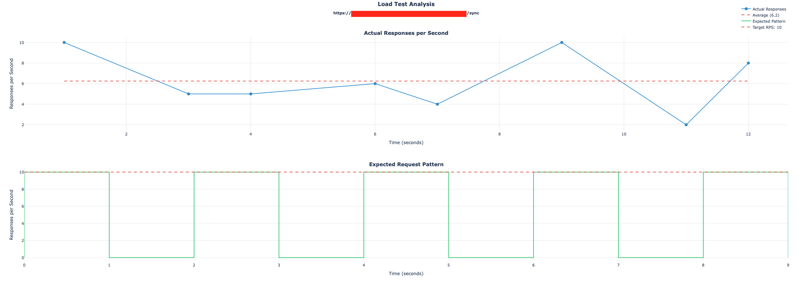
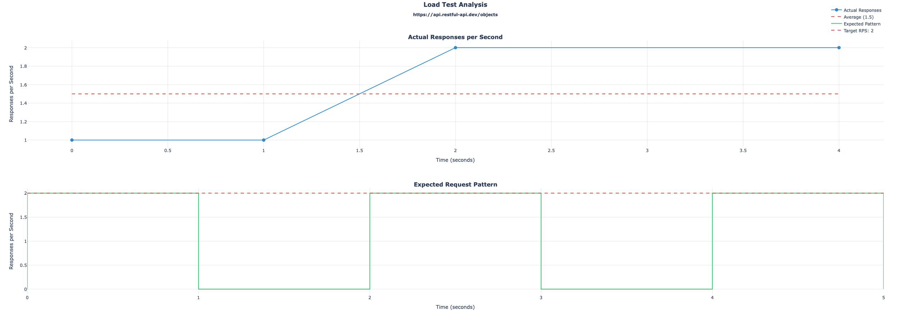

# Stress Lab

## Limitations with Locust

### How Locust Works
Locust simulates user behavior through its "user classes". Here's how it operates:

1. Each simulated user follows a defined behavior pattern:
   - Makes a request to the API
   - Waits for the complete response
   - Processes the response
   - Waits for a random time (defined by `wait_time`)
   - Repeats the cycle

2. Users are spawned at a specified rate (e.g., 10 users/second) until reaching the target number of users.

3. Each user operates independently, maintaining their own request cycle.

### Limitations for System Stress Testing

1. **Request Rate Unpredictability**
   - In Locust, you control the number of users, not the request rate
   - Each user's request timing depends on:
     * Response download time
     * Response processing time
     * Random wait time
   - This makes it impossible to maintain a consistent request rate
   - Example: If you want exactly 100 requests/second, Locust cannot guarantee this

2. **Network Dependency**
   - Each request must complete its entire cycle before the next one begins
   - For large responses (e.g., 5MB), the client must:
     * Wait for the complete response
     * Download it fully
     * Process it
   - This means your stress test is limited by the client's network capacity
   - Example: Testing an API that returns 5MB responses at 100 RPS requires the client to download 500MB/second

3. **Single Client Bottleneck**
   - In production: 100 different devices can each handle their own response processing
   - In Locust: A single machine must process all responses
   - This creates an artificial bottleneck that doesn't reflect real-world scenarios
   - Example: If your API serves 5MB responses to 100 different mobile devices, each device needs to download 5MB. But with Locust, one machine needs to download all 500MB.

4. **User Simulation vs Pure Load Testing**
   - Locust excels at simulating real user behavior
   - However, for understanding raw system capacity, this behavior becomes a limitation
   - You can't push the system to its actual limits because you're bound by simulated user behavior

> **Note:** While Locust excels at simulating real user behavior, it's challenging to use it for determining exact system limits. This is because:
> 1. The actual request rate depends on response times and simulated user behavior
> 2. Network capacity of the test machine affects results
> 3. Resource consumption on the test machine can become a bottleneck before the system under test

> **Important:** Locust is designed to answer questions like "How does my system behave under realistic user load?" rather than "What's the maximum RPS my system can handle?"

## Limitations with JMeter
JMeter operates similarly to Locust in terms of the request-response cycle. While it uses a different technical approach (threads vs event-driven), the fundamental limitations are indeed similar:

Both tools simulate users who:
1. Send a request
2. Wait for response
3. Process response
4. Wait before next request


Therefore, both tools share these key limitations:
1. Can't maintain exact request rates
2. Are affected by client-side network capacity
3. Face single-machine bottlenecks for response processing

---

## Features

Stress Lab provides several key features for precise system stress testing:

1. **Precise Rate Control**: 
   - Maintain exact control over requests per second
   - Requests are sent in batches at specified intervals
   - Example: 100 requests/batch, every 1 second = consistent 100 RPS

2. **Flexible Response Handling**:
   - TTFB-only mode: Measure server response time without downloading full response
   - Complete response mode: Analyze full request-response cycle including response sizes
   - Choose based on your testing needs. Default is TTFB-only mode.

3. **Batch Processing**:
   - Requests are sent in controlled batches
   - Each batch sends the specified number of concurrent requests
   - Configurable wait time between batches
   - Example: With 100 RPS and 1s wait time:
     * Batch 1: 100 concurrent requests sent at t=0
     * Wait 1 second
     * Batch 2: 100 concurrent requests sent at t=1
     * And so on...

4. **Comprehensive Metrics**:
   - Request success/failure rates
   - Time taken for all the batches to complete & true RPS
   - Response time statistics (mean, median, max, min)
   - Percentile measurements (90th, 95th, 99th)
   - Response size statistics (when complete response mode is enabled)

5. **Visualization**:
   - Two synchronized plots:
     * Top: Actual responses recorded per second
     * Bottom: Expected request pattern with target RPS
   - Interactive features:
     * Hover tooltips showing exact values
     * Zoomable plots for detailed analysis
     * Pan across time periods
   - Statistical overlays:
     * Average response rate
     * Target RPS reference lines
     * Test parameters summary

## How to use
Parameters:
- `url`: The URL of the API endpoint to test
- `method`: The HTTP method to use (GET, POST, PUT, DELETE, etc.)
- `headers`: Optional headers to include in the request
- `json_data`: Optional JSON data to include in the request body (for POST, PUT, etc.)
- `requests_per_second`: The target requests per second to maintain. This is the rate at which requests will be sent.
- `num_times`: The number of times to repeat the test. Each test run will send requests at the specified rate.
- `wait_time`: The time to wait between each test run (in seconds)
- `ttfb_only`: If `True`, only the Time To First Byte (TTFB) will be measured. If `False`, the full response time will be measured.


### GET Request Test
```python
import asyncio
from stress_lab import load_test, print_statistics, plot_load_test_results

# URL, headers and request parameters
url = "..."
method = "GET"
headers = {"Authorization": "Bearer ..."}

# Test parameters
requests_per_second = 10
num_times = 5
wait_time = 1
ttfb_only = True

# Run the load test
stats = asyncio.run(
    load_test(
        url=url,
        method=method,
        headers=headers,
        requests_per_second=requests_per_second,
        num_times=num_times,
        wait_time=wait_time,
        ttfb_only=ttfb_only,
    )
)

# Print statistics
print_statistics(stats=stats)

# Plot the results
plot_load_test_results(
    url=url,
    stats=stats,
    requests_per_second=requests_per_second,
    num_times=num_times,
    wait_time=wait_time,
)

```

***Example Output***

```bash
Test Summary:
Total Duration: 13.56 seconds
Total Requests: 50
Total Success: 50
Total Failures: 0
Requests per Second: 3.69

Response Time Statistics:
Avg TTFB: 1.454s
Max TTFB: 2.171s
Min TTFB: 0.674s
Median TTFB: 1.459s

Percentiles:
90th Percentile TTFB: 1.738s
95th Percentile TTFB: 2.127s
99th Percentile TTFB: 2.165s
```



### POST Request Test
```python
import asyncio
from stress_lab import load_test, print_statistics, plot_load_test_results

# URL, headers and request parameters
url = "..."
method = "POST"

json_data = {
   "name": "Apple MacBook Pro 16",
   "data": {
      "year": 2019,
      "price": 1849.99,
      "CPU model": "Intel Core i9",
      "Hard disk size": "1 TB"
   }
}

# Run the load test
stats = asyncio.run(
    load_test(
        url=url,
        method=method,
        json_data=json_data,
        requests_per_second=5,
        num_times=5,
        wait_time=1,
        ttfb_only=True,
    )
)

# Print statistics
print_statistics(stats=stats)

# Plot the results
plot_load_test_results(
    url=url,
    stats=stats,
    requests_per_second=2,
    num_times=3,
    wait_time=1,
)
```

***Example Output***

```bash

Test Summary:
Total Duration: 5.41 seconds
Total Requests: 6
Total Success: 6
Total Failures: 0
Requests per Second: 1.11

Response Time Statistics:
Avg TTFB: 0.695s
Max TTFB: 1.111s
Min TTFB: 0.166s
Median TTFB: 0.807s

Percentiles:
90th Percentile TTFB: 1.081s
95th Percentile TTFB: 1.096s
99th Percentile TTFB: 1.108s
```

